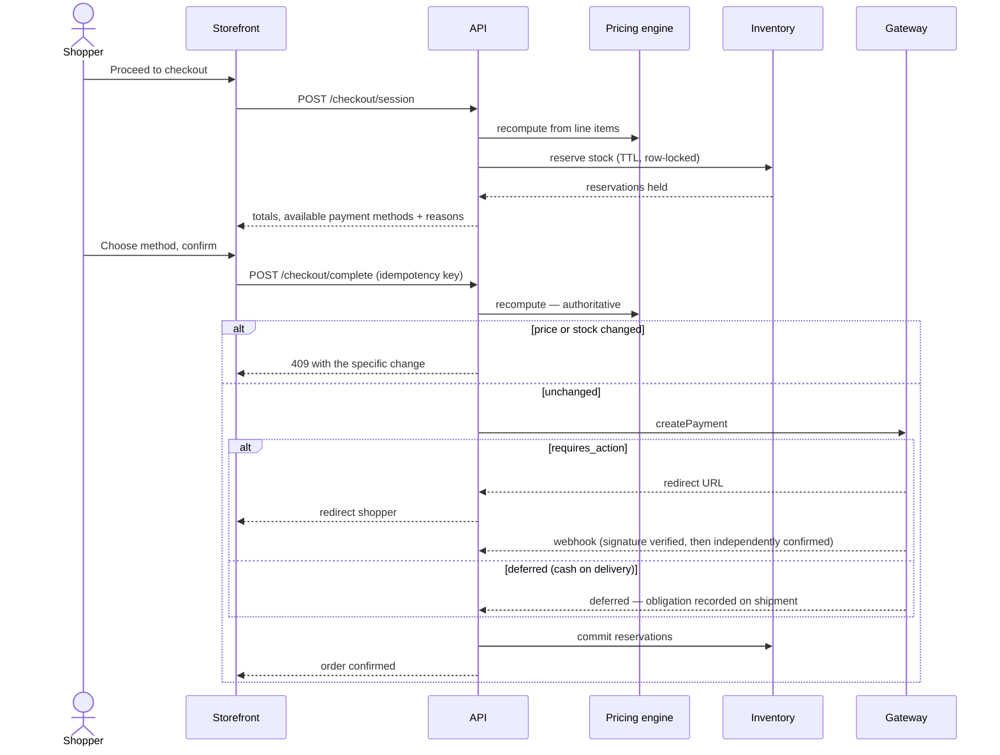

# Product Requirements

## The business problem

An electronics retailer selling smartphones, accessories and computer gear has three costs that
scale faster than revenue and that software can actually remove:

1. **Manual catalogue work.** A supplier spreadsheet arrives with specifications trapped in a
   free-text blob. Someone types them in. Filtering, comparison and search all depend on that typing
   being consistent, and it never is.
2. **Stock decisions made by memory.** Fast movers stock out during the week it matters. Capital sits
   frozen in accessories for a handset discontinued two seasons ago. Nobody notices either until it
   is expensive.
3. **Order handling that does not scale.** Cash-on-delivery refusals cost round-trip freight and a
   week of stock availability per incident. Every WhatsApp order is retyped into a system by hand.

Everything in this product is aimed at one of those three. A feature that does not reduce a cost or
increase conversion is not a priority, regardless of how impressive it demos.

## Success metrics

| Metric | Baseline assumption | Target | Why it moves |
|---|---|---|---|
| Conversion rate | 1.2% | 2.0% | Faster pages, honest stock signals, COD offered where safe |
| Cart abandonment | 72% | 60% | Fewer checkout steps, guest checkout, WhatsApp fallback |
| Zero-result searches | 18% | <6% | Hybrid retrieval + logged failures becoming merchandising actions |
| COD refusal rate | 15% | <8% | Risk scoring gating COD and requesting partial advance |
| Stockouts on top-50 SKUs | ~12/month | <3/month | Lead-time-aware reorder points with variability-derived safety stock |
| Hours/week on catalogue entry | 10 | <2 | AI extraction from supplier text, merchant reviews rather than types |
| Dead stock as % of capital | 14% | <6% | Nightly classification and markdown prompts |

## Personas

**Sumon — the owner.** Runs the business from a phone between supplier calls. Needs to know what
needs attention today, not a dashboard of charts. Every screen he sees is judged by: could he act on
this in under a minute?

**Rina — the operator.** Handles orders, packing and customer messages. Lives in the order list.
Needs the fewest possible clicks between "order arrived" and "parcel labelled", and needs to never
promise stock that is not there.

**Karim — the shopper.** On a mid-range Android phone, on mobile data, comparing three sites. Will
abandon a page that takes four seconds. Wants to know: is it genuine, what is the warranty, can I
pay cash, when does it arrive.

**Nasrin — the accountant.** Monthly. Needs exportable, reconcilable numbers where the gateway
settlement matches the order ledger without a spreadsheet.

## User stories with acceptance criteria

Written as *observable behaviour*. A story with no falsifiable criterion is a wish.

### Storefront

**S-01 — Find a product by model number**
> As a shopper who knows exactly what I want, I can type a model number and get that product first.

- Given a query matching a SKU or MPN, the exact product ranks first
- The query is classified `identifier`, weighting lexical retrieval over semantic
- Response returns within 300 ms at p95 on a warm cache
- A typo of one character still matches via trigram similarity

**S-02 — Find a product by describing it**
> As a shopper who does not know model names, I can describe what I want and get sensible results.

- "phone with a good camera under 40000" returns phones, not chargers
- Zero results never renders a dead end: alternatives and a WhatsApp route are always offered
- Every zero-result query is logged with its normalised form for merchandising review

**S-03 — Trust the stock indicator**
> As a shopper, when the page says three left, there are three.

- Availability shown is `onHand − reserved`, from the same function the checkout enforces
- Exact counts appear only at or below the low-stock threshold; above a ceiling the UI says "In
  stock" without a number
- An out-of-stock variant is visibly disabled, never silently unselectable

**S-04 — Check out as a guest**
> As a first-time buyer, I can order without creating an account.

- Phone number is sufficient identity; email is optional
- The order is retrievable later by order number plus phone
- An account can be claimed after the fact without re-entering the order

**S-05 — Pay the way I actually pay**
> As a shopper, I am offered the payment methods available to me, and told why one is not.

- Methods are filtered by currency, amount bounds, gateway health and per-method eligibility
- An unavailable method is shown greyed with a customer-readable reason, never silently hidden
- COD refusal offers prepayment as the alternative in the same message

**S-06 — Order over WhatsApp**
> As a shopper who does not fill in web forms, I can order by message.

- Every product page has a WhatsApp action pre-filled with product, variant and SKU
- The resulting order is created with `channel = whatsapp` and appears in the same order list

### Admin

**A-01 — Know what needs attention**
> As the owner, opening the dashboard tells me today's problems, ranked.

- Flagged orders, imminent stockouts, and frozen capital appear above the fold
- Every item carries a specific action ("order 40 units before Thursday"), not an observation
- Ranking is by money at stake, not by percentage change

**A-02 — Import a supplier list without retyping it**
> As the owner, I paste supplier text and get structured, filterable products.

- Specifications are extracted into typed attributes with normalised units ("8GB", "8 GB" → "8 GB")
- Category is assigned with a confidence score; below 0.6 it falls back to the parent category
- Everything is a draft until the merchant approves it

**A-03 — Never be surprised by a stockout**
> As the owner, I am told to reorder before I run out, with a quantity.

- Reorder point accounts for supplier lead time and demand variability at a 95% service level
- The forecast method and its backtested error are displayed next to the recommendation
- Nothing orders itself; a purchase order is created by a person

**A-04 — See true margin**
> As the owner, margin reflects landed cost and gateway fees, not just price minus cost.

- Unit cost is snapshotted on the order line at placement, so historical margin survives cost changes
- Gateway fees are recorded per transaction and subtracted from net
- Cost and margin are behind the `finance:read` permission, invisible to support and warehouse roles

**A-05 — Approve AI output before customers see it**
> As the owner, no generated text reaches a customer without me approving it.

- Generated descriptions, meta content and campaign copy enter `awaiting_review`
- The generating task, prompt version and model are recorded against the output
- Rejection is recorded as a labelled signal for prompt evaluation

## Information architecture

```
Storefront                          Admin
├── Home                            ├── Sell
├── Category                        │   ├── Dashboard
│   └── Sub-category                │   ├── Products → Variants → Media
├── Search (faceted, noindex)       │   └── Customers → Orders, Addresses
├── Product                         ├── Fulfil
│   ├── Variants                    │   ├── Orders → Timeline, Payments
│   ├── Specifications              │   ├── Shipments
│   ├── Reviews                     │   └── Returns
│   └── Related / accessories       ├── Stock
├── Cart                            │   ├── Inventory → Forecast, Reorder
├── Checkout                        │   ├── Purchase orders
│   ├── Delivery                    │   └── Suppliers
│   ├── Payment                     └── Grow
│   └── Confirmation                    ├── Campaigns → Content approval
├── Account                             ├── Discounts
│   ├── Orders → Tracking               └── Reports → Revenue, Margin, Search
│   ├── Wishlist
│   └── Addresses
└── Help (delivery, returns, warranty)
```

**Storefront navigation is by category, not by brand.** Shoppers arrive with a job ("I need a
charger"), not a brand loyalty, and brand-first navigation buries the 80% of the catalogue that is
accessories.

**Admin navigation is by job, not by table.** "Sell / Fulfil / Stock / Grow" maps to how the day
divides. A flat list of entities mirrors the schema, not the work, and makes the merchant hunt.

## Critical flows

### Checkout



Two properties this flow guarantees: **the price is recomputed server-side immediately before
authorisation**, so a stale cached page cannot produce a wrong charge; and **stock is reserved
before payment and committed after**, so a slow gateway cannot oversell.

### AI-assisted product creation

```mermaid
sequenceDiagram
    actor Merchant
    participant Admin
    participant AI as AI gateway
    participant Queue as Job runner
    participant DB

    Merchant->>Admin: Paste supplier text
    Admin->>Queue: enqueue product.categorise
    Queue->>AI: run (budget checked first)
    AI-->>Queue: category + typed attributes + confidence
    Queue->>DB: write draft, status awaiting_review
    Queue->>AI: run product.describe, seo.generate
    AI-->>Queue: copy + metadata
    Queue->>DB: write drafts with promptVersion + model
    Admin-->>Merchant: Review screen with diffs
    Merchant->>Admin: Approve / edit / reject
    Admin->>DB: publish; record decision as an eval signal
```

The merchant is never blocked on a model call, nothing publishes itself, and every output carries
the prompt version that produced it.
