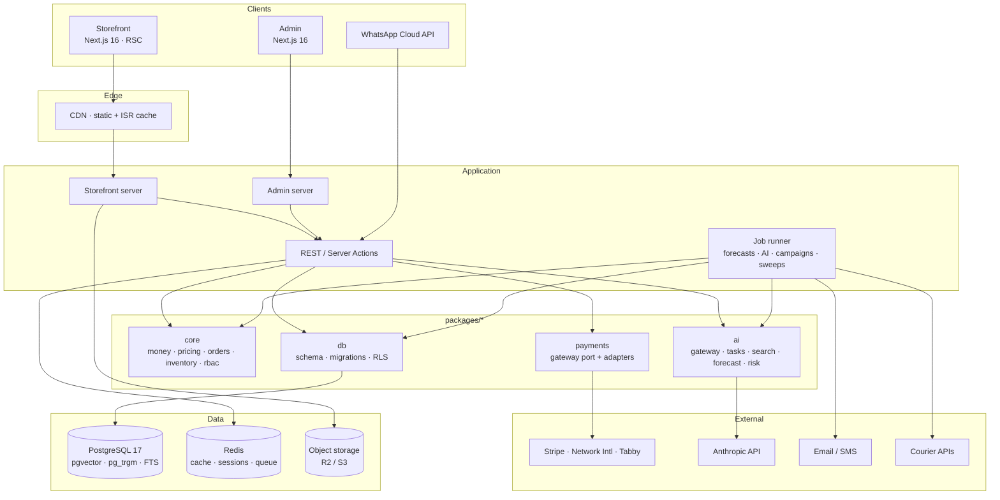

# Architecture

## System view



## Dependency rule

Dependencies point inward. `core` depends on nothing but the language.

```
apps  →  payments · ai  →  core
  ↓          ↓
  └──────→  db  ────────→  core
```

`core` contains no I/O: no database handle, no `fetch`, no clock beyond what is passed in. That is
what makes the pricing engine, the state machine and the allocation logic testable without
infrastructure — 152 tests run in under 300 ms with no containers. It is also what stops business
rules leaking into route handlers, where they become untestable and get duplicated.

## Request lifecycle

```mermaid
sequenceDiagram
    participant C as Client
    participant E as Edge/CDN
    participant M as Middleware
    participant P as Page/Route
    participant T as withTenant()
    participant D as Postgres

    C->>E: GET /products/galaxy-s25-ultra
    alt cached and fresh
        E-->>C: static HTML (single-digit ms)
    else
        E->>M: forward
        M->>M: resolve tenant from host, CSP nonce, rate limit
        M->>P: request + tenant context
        P->>T: query
        T->>D: BEGIN; set_config('app.tenant_id', …, true)
        D-->>T: rows (RLS filtered)
        T-->>P: data
        P-->>E: HTML + revalidate directives
        E-->>C: HTML, cached for the next visitor
    end
```

Tenant resolution happens once, in middleware, and is carried as context. It is never read from a
request body or a query parameter — a tenant id the client can set is not an isolation boundary.

## Multi-tenancy

**Shared database, shared schema, row-level security.** Every tenant-owned table carries
`tenant_id`; RLS policies compare it against a transaction-local setting.

| Model | Why not |
|---|---|
| Database per tenant | Strongest isolation, and correct at enterprise contract sizes. Rejected at this scale: migrations across thousands of databases become an operations project, and connection pooling degrades badly. |
| Schema per tenant | Same migration problem, plus Postgres catalogue bloat past a few thousand schemas. |
| Shared, application-filtered only | What most products do. One forgotten `WHERE` is a cross-merchant breach. |

**Shared + RLS** keeps one migration path and puts the isolation boundary in the database, where a
missing application filter yields an empty result set instead of another tenant's orders.

The cost is that a noisy tenant shares a connection pool. The mitigation is per-tenant rate limits
and, at the top of the plan ladder, a dedicated database — which the same schema supports, because
`tenant_id` does not stop working when there is only one of them.

## Caching layers

| Layer | Holds | Invalidated by |
|---|---|---|
| CDN / ISR | Product and category HTML | `revalidateTag` on catalogue writes; 60 s floor on PDPs |
| Redis | Sessions, cart state, rate counters, search results | TTL; explicit delete on cart mutation |
| Postgres | The truth | — |
| Prompt cache | AI task system prompts | Automatic; ~90% input cost reduction on repeated tasks |

**Prices and stock are never served from a cache at the moment of decision.** A cached page may show
a stale price; the checkout recomputes before authorising. That asymmetry is deliberate — it buys
CDN-speed browsing without ever charging the wrong amount.

## Background work

Anything that is slow, retryable, or would block a merchant runs out of band:

| Job | Cadence | Notes |
|---|---|---|
| Reservation expiry sweep | 1 min | Releases abandoned holds; without it a closed tab freezes stock |
| Demand forecast | Nightly | All SKUs; writes `demand_forecasts` with backtested error |
| Inventory health | Nightly | Dead / slow / overstock classification |
| Embedding backfill | On write, debounced | Skips rows whose `sourceHash` is unchanged |
| Review summary | On threshold crossing | Never on page render — 400 reviews inside a request blows LCP and the AI bill |
| Abandoned cart recovery | Hourly | Drafts only; a human approves before send |
| Webhook reconciliation | 15 min | Pulls gateway status for intents with no terminal webhook |
| Supplier scorecard | Nightly | On-time %, defect rate, price competitiveness |

The reconciliation job is not optional. Webhooks are missed — the question is only whether the
system notices.

## Folder structure

```
packages/db/src/
  schema/{tenancy,catalog,inventory,commerce,payments,marketing,ai}.ts
  client.ts        pooling, withTenant(), replica routing
  id.ts            UUIDv7
  sql/             extensions.sql, policies.sql (idempotent, re-run every deploy)

packages/core/src/
  money.ts         Money type, allocation, formatting
  pricing/         engine.ts — the single source of truth for totals
  orders/          state-machine.ts — three-axis transitions
  inventory/       availability.ts — allocation, reservation policy
  rbac.ts          permissions, seeded roles
  errors.ts        DomainError — internal message vs publicMessage

packages/payments/src/
  gateway.ts       the port + capability declarations
  registry.ts      availability, ordering, per-gateway circuit breakers
  retry.ts         backoff with full jitter, CircuitBreaker
  adapters/        cod, sslcommerz, bkash, stripe

packages/ai/src/
  client.ts        metered gateway: budget, caching, structured output
  models.ts        pricing table, cost accounting in micro-USD
  tasks.ts         registry: prompts, schemas, tiers, review policy
  search/fusion.ts RRF, boosts, query intent
  forecast.ts      seasonal naive / Holt / Croston + replenishment
  risk.ts          explainable order risk, segmentation
```

## Failure behaviour

| Failure | Behaviour |
|---|---|
| Anthropic unavailable | AI features degrade to unavailable with a typed error. Storefront and checkout unaffected. |
| One gateway down | Its circuit breaker opens; checkout offers the others within milliseconds instead of after a 15 s timeout. |
| Redis down | Sessions fall back to signed cookies; rate limiting fails closed on write paths, open on reads. |
| Replica lag | Catalogue reads may be stale by seconds. Cart, checkout and inventory never read from a replica. |
| Postgres primary down | Writes fail loudly. Cached catalogue pages continue to serve from the CDN, so the store stays browsable while it is not orderable. |
