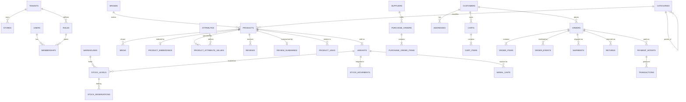

# Data Model

45 tables across seven domains. Full definitions in `packages/db/src/schema/`. This document covers
the relationships and — more usefully — the modelling decisions that are not obvious from the DDL.

## Core commerce



## The decisions worth explaining

### Product vs variant

A **product** is the marketing entity — one page, one title, one review stream. A **variant** is the
unit of sale, with its own SKU, price, cost and stock. A phone in three colours × two storage tiers
is one product and six variants.

Modelling the variant as the sellable unit from day one avoids the migration every store eventually
faces when "one SKU per product" collapses — which happens the first time a supplier ships the same
handset in two colours.

### Serialised units

`serial_units` tracks individual physical items by serial number and IMEI. This is the table that
separates a real electronics platform from a generic template:

- IMEI capture is a legal requirement for handset sales in many markets
- A warranty claim needs *that unit's* purchase date, not the SKU's
- A stolen device is traced by serial

Accessories skip it entirely. `variants.isSerialised` switches the inventory engine between quantity
mode and per-unit mode, so a store selling both does not pay the per-unit cost on cables.

### Three quantities, not one

`stock_levels` splits `onHand`, `reserved` and `incoming`. A single `quantity` column is the classic
oversell bug: two shoppers both read "1 left", both check out, one gets a phone call.

Reservations are rows with a TTL, created inside the transaction that validates availability using
`SELECT … FOR UPDATE` on the stock row. Concurrency is serialised per (variant, warehouse) — exactly
the granularity that matters, costing nothing on unrelated SKUs. A background sweep expires stale
holds, so a closed tab does not freeze a unit forever.

### Ledgers, not mutable counters

`stock_movements`, `transactions`, `loyalty_transactions` and `store_credit_entries` are append-only.
Balances are projections; if a projection disagrees with its ledger, the ledger is right and the
reconciliation job rebuilds the cache.

A mutable balance plus concurrent refunds is how stores accidentally hand out free money. And
"we're short three units and nobody knows why" is unanswerable without a ledger.

`audit_logs` goes further: `UPDATE` and `DELETE` are revoked at the grant level, so even a fully
compromised application credential cannot erase its own tracks.

### Embedded addresses on orders

`orders.shippingAddress` is a JSONB copy, not a foreign key. An invoice must render the address as
it was when the order shipped; if the customer later edits their saved address, historical orders
must not silently change. This is the one place denormalisation is a correctness requirement rather
than a shortcut. The same reasoning puts `sku`, `title` and `unitCost` snapshots on `order_items`.

### UAE addresses have no postal code

`addresses` carries `emirate`, `area`, `buildingName`, `flatOrVilla` and `makani`. `postalCode`
exists only so the schema can hold a non-UAE address, and is never required.

This is the detail that breaks imported checkout flows. A mandatory postal-code field either blocks
the order or trains every customer to type "00000" — which then defeats address validation, courier
zone lookup and fraud scoring simultaneously. What a UAE courier actually needs is the emirate
(which sets the delivery zone and fee), the community, a building name, and ideally a **Makani**
number: a 10-digit geo-address resolving to a specific building entrance that couriers navigate to
directly. Where a Makani is present it is more reliable than any written address, which is why
`validateAddress` accepts it as sufficient on its own and treats a PO Box as insufficient.

`addresses_emirate_idx` exists because every courier-zone lookup and per-emirate delivery report
filters on it.

### Tenant tax identity

`tenants` carries `legalName`, `taxRegistrationNumber`, `tradeLicenceNumber`, `vatRateBps` and
`pricesIncludeVat`. The TRN is on the tenant rather than in configuration because it appears on
every invoice that tenant issues, and a UAE tax invoice without one is not valid — a business
customer will reject it because they cannot reclaim the input VAT.

`vatRateBps` is a column, not a constant, for the same reason `pricesIncludeVat` is: rates are set
by the Federal Tax Authority and do change, and a rate compiled into code is a rate that ships
wrong.

### Category path

Categories use an adjacency list plus a materialised `path`. Adjacency alone needs a recursive CTE
for every breadcrumb and every "all descendants" filter — the hottest query on a listing page. A
closure table is the textbook answer but costs O(depth × nodes) rows and a lot of write bookkeeping.
Electronics taxonomies are shallow and change rarely, so an indexed, denormalised path of ancestor
slugs gives single-index-scan descendant queries for a fraction of the complexity.

### Attributes as rows

Electronics live or die on filterable specs. Storing them as free-text JSON on the product makes
"8 GB RAM" and "8GB RAM" different facets and destroys filtering. `attributes` declares a typed,
unit-bearing definition; `product_attribute_values` joins them. This is why AI categorisation
normalises units — the extraction feeds a facet, not a paragraph.

### Embeddings in a sidecar

`product_embeddings` is a separate table because a 1024-dimension vector is ~6 KB of the row.
Inlining it would bloat every product read with data only the search path uses, and force a rewrite
of the entire heap tuple on every price change. The sidecar also lets the embedding model be
versioned and backfilled without touching the catalogue.

HNSW over IVFFlat: slower to build, dramatically better recall at the catalogue sizes this targets,
and no retraining as the catalogue grows.

### Payments name no providers

There is no `stripe_charge_id` column and no `bkash_trx_id` column. Every row carries `provider`, a
provider-agnostic status, and a `raw` JSONB blob holding the untouched payload for forensics. Adding
a gateway is a data change plus one adapter file, never a migration.

`payment_intents` express intent; `transactions` are the immutable financial facts.
`orders.paidTotal` is a projection of captured transactions, and any disagreement is a
reconciliation bug in which the transactions win.

`payment_webhook_events` persists the raw envelope *before* processing, with a unique constraint on
the provider's event id. That gives exactly-once processing, a replay tool for when a handler has a
bug, and an answer to "the gateway says they told us — did they?"

### Analytics partitioned

`analytics_events` is the highest-volume table by two orders of magnitude and is partitioned
monthly. Retention becomes an instant `DETACH PARTITION` rather than a multi-hour `DELETE` holding
locks on the busiest table in the system.

## Integrity constraints

Expressed in SQL because they protect money and must hold regardless of which code path writes:

```sql
CHECK (reserved >= 0)
CHECK (total >= 0 AND refunded_total <= paid_total)
CHECK (quantity > 0 AND quantity_refunded BETWEEN 0 AND quantity)
CHECK (rating BETWEEN 1 AND 5)
CHECK (balance >= 0 AND balance <= initial_amount)   -- gift cards
```

## Index strategy

Every tenant-scoped index leads with `tenant_id`, so a tenant's working set is physically clustered
and a cross-tenant read is obvious in `EXPLAIN`.

| Index | Serves |
|---|---|
| `products_tenant_status_idx` | Every catalogue listing |
| `products_title_trgm_idx` (GIN) | Typo-tolerant model-name matching |
| `products_search_vector_idx` (GIN) | Full-text lexical retrieval |
| `product_embeddings_hnsw_idx` | Semantic nearest-neighbour |
| `pav_tenant_attr_{text,num}_idx` | Facet intersection |
| `carts_abandonment_idx` | The abandoned-cart sweep |
| `stock_reservations_sweep_idx` | The expiry sweep |
| `orders_tenant_created_idx` | The order list, the most-loaded admin query |
