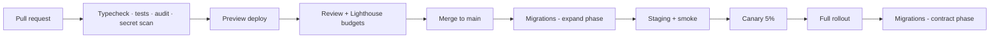

# Performance, Testing & Deployment

## Performance budgets

Budgets, not aspirations: CI fails when a page exceeds them.

| Metric | Budget | Why this number |
|---|---|---|
| LCP (p75, mobile) | ≤ 2.0 s | Below Google's 2.5 s "good" threshold, with headroom for a congested 4G network |
| INP (p75) | ≤ 150 ms | The 200 ms threshold is the failure line, not the target |
| CLS | ≤ 0.02 | Effectively zero. A tile that moves under a thumb costs a tap on the wrong product |
| TTFB (cached) | ≤ 100 ms | Achievable from the edge; anything more means the cache is not working |
| JS shipped, PDP | ≤ 90 KB gzipped | One interactive island. Everything else is server-rendered |
| JS shipped, listing | ≤ 60 KB gzipped | Zero islands |
| Search p95 | ≤ 300 ms | Beyond this, shoppers re-type rather than wait |
| Type-ahead p95 | ≤ 80 ms | Above this it feels laggy rather than instant |
| Checkout API p95 | ≤ 500 ms | Includes pricing recomputation and reservation |

### How they are met

**Server components by default.** A listing page ships markup, not a component tree plus data plus a
hydration pass. `use client` appears in exactly one storefront component.

**Layout stability by construction.** Every media box has a fixed `aspect-ratio`, so the grid does
not reflow as images arrive. This is why CLS is budgeted at 0.02 rather than 0.1 — it is a design
property here, not something to optimise later.

**Static-first with ISR.** Product pages are prerendered and revalidated on a 60 s floor, so they
serve from the edge *and* reflect a price change within a minute. Personalised strips stream in as
separate islands rather than making the whole page dynamic — that trade is what quietly destroys LCP
on most commerce sites.

**Image discipline.** AVIF/WebP, explicit dimensions, `deviceSizes` matched to the layout's actual
breakpoints rather than the framework defaults, and LQIP blur placeholders stored on the media row.

**Query discipline.** Every tenant-scoped index leads with `tenant_id`. `pg_stat_statements` is
enabled in every environment; any query over 100 ms at p95 is a bug with an owner.

## Testing strategy

```
        ╱ Manual exploratory — before each release
       ╱ E2E (Playwright) — the money paths only
      ╱ Integration — DB, gateways, jobs
     ╱ Unit — domain logic
```

**Unit (152 tests today, <300 ms, no infrastructure).** Everything in `packages/core` and the pure
modules of `packages/ai`. These are fast because `core` has no I/O, which is the whole reason for the
dependency rule.

Notable coverage:
- **Allocation is fuzz-tested** across 500 random splits per run, asserting parts always sum exactly
  to the whole. Rounding drift is the kind of bug that ships and is found in an audit.
- **Tax is tested inclusive and exclusive**, because taxing the pre-discount amount overcharges the
  customer and is unlawful in most VAT regimes.
- **Discount stacking is tested against the giveaway case** — three stacked 90%-off coupons must
  never drive a line below zero.
- **The role table is walked** to assert every role that can refund requires MFA. Adding a
  money-moving role without MFA fails the build.
- **Webhook verification is tested against tampering and replay**, not just the happy path.

**Integration.** Real Postgres in CI (`pgvector/pgvector:pg17`). Covers migrations applying cleanly
from empty, RLS actually blocking cross-tenant reads, concurrent checkout not overselling under
parallel transactions, and gateway adapters against recorded fixtures.

The RLS test is the one that must never be deleted: it asserts that a query with the wrong tenant
context returns zero rows, which is the property the entire multi-tenancy story rests on.

**E2E (Playwright).** Deliberately few, and only on paths where failure costs money: browse → PDP →
add to cart → checkout → payment (sandbox) → confirmation; guest order lookup; admin order refund.
E2E suites rot in proportion to their size, and a flaky suite is worse than a small one because it
trains the team to ignore red.

**Load.** k6 against a seeded 50k-SKU catalogue, targeting 500 concurrent browsers and 50 checkouts
per minute, with p95 assertions matching the budgets above. Not yet run — first item in Phase 2.

**AI evaluation.** Task outputs are scored against a fixture set: does categorisation pick the right
node, does extraction normalise units, does the review summary include the negatives. Merchant
approve/reject decisions are recorded as labelled data, which is what makes prompt changes
measurable rather than vibes.

## Deployment



**Migrations are expand/contract, always.** Add the column, backfill, deploy code that writes both,
deploy code that reads the new one, then drop the old — across separate releases. A migration that
requires code and schema to change simultaneously cannot be rolled back, and the moment you need a
rollback is the moment you discover that.

**Rollback.** Application: previous immutable image, under a minute. Database: forward-only. A
"down" migration that has never been run is fiction; recovery is a new migration or a
point-in-time restore.

**Environments.** Local (docker-compose), preview (per PR, ephemeral database), staging (production
topology, anonymised data), production.

**Infrastructure targets.**

| Component | Choice | Reasoning |
|---|---|---|
| Apps | Containers on a managed platform, or Vercel | ISR and edge caching work out of the box; containers keep the exit open |
| Postgres | Neon or RDS Aurora Serverless v2 | Branching for preview environments is worth real money in review velocity |
| Connection pooling | PgBouncer, transaction mode | Non-negotiable with serverless instance counts |
| Redis | Upstash or ElastiCache | — |
| Objects | Cloudflare R2 | S3-compatible with no egress fee — material when serving product images |
| Queue | Redis-backed worker, then SQS | Start simple; the interface hides the swap |
| Observability | OpenTelemetry → any backend | Vendor-neutral instrumentation; the backend is a config change |

**Cost at launch** (single merchant, ~10k monthly orders): roughly $120–260/month excluding AI,
dominated by database and application compute. AI cost is metered per tenant and bounded by the
daily budget — at the default $25/day ceiling the worst case is knowable in advance, which is the
entire point of metering it.

## Monitoring

**Alert on symptoms, not causes.** Nobody should be paged for high CPU; they should be paged because
checkout is failing.

| Alert | Threshold | Severity |
|---|---|---|
| Checkout error rate | >2% over 5 min | Page |
| Payment webhook processing lag | >5 min | Page |
| Order creation rate | <50% of the 7-day baseline for this hour | Page |
| Search p95 | >800 ms over 10 min | Ticket |
| AI budget exhausted | any tenant | Ticket |
| Reservation sweep lag | >5 min | Ticket |
| Dead-letter queue depth | >0 | Ticket |

The order-rate alert is the one that catches the failures no error rate reveals — a broken payment
method or a checkout page that renders but does not submit produces zero errors and zero orders.

## Definition of done

A change ships when: types pass, tests cover the new behaviour, the performance budget holds, an
audit-log entry exists if it touches money or permissions, the error path returns a customer-safe
message, and the migration is expand-phase-safe. Not before.
