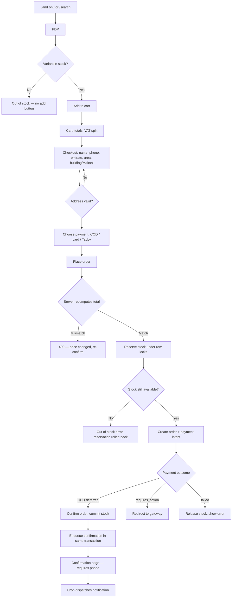
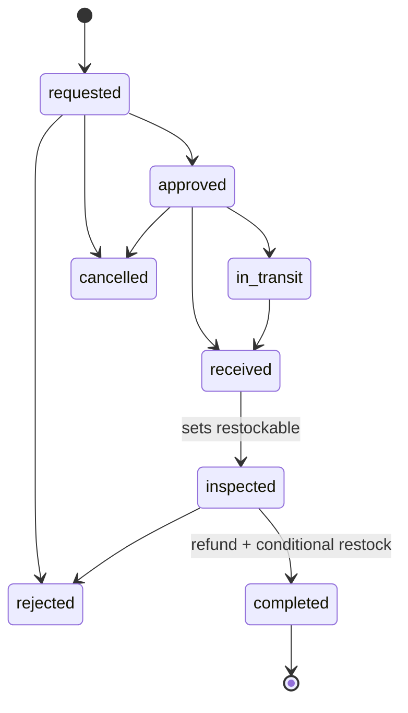
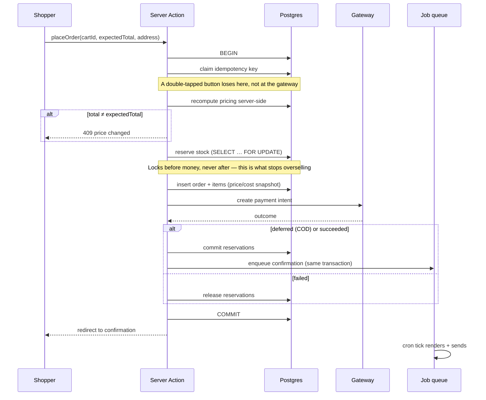
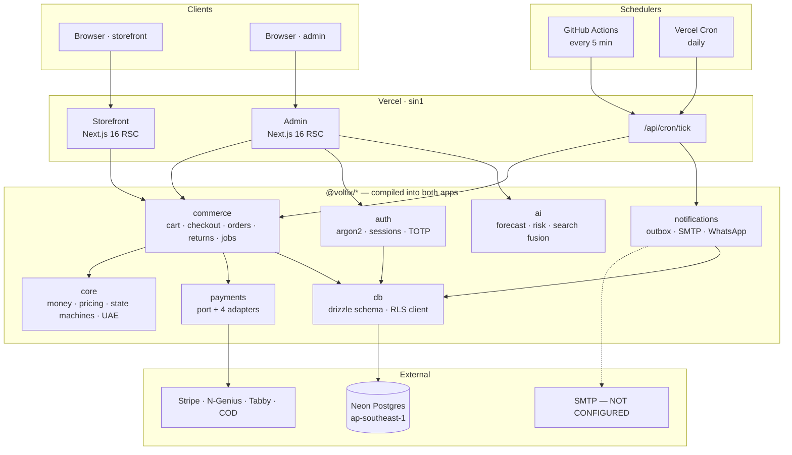
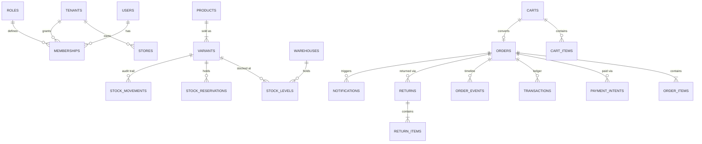

# Voltix Commerce — Product & Technical Master Document

**Status:** Reverse-engineered audit · **Date:** 2026-08-09 · **Commit:** `dcd7947`
**Author:** Retrospective audit (PM / TPM / UX / Architect / Eng Lead perspectives)

---

## How to read this document

This was reconstructed *from the code*, not from prior intent. Every claim is labelled:

| Label | Meaning |
|---|---|
| **CONFIRMED** | Verified by reading code, running it, or querying the database |
| **INFERRED REQUIREMENT** | Deduced from implementation; nobody wrote it down as a requirement |
| **IMPLICIT DECISION** | A real decision made in code without visible product justification |
| **UNKNOWN / NEEDS CONFIRMATION** | Genuinely undetermined; do not guess |

**A correction to the premise of this audit.** The brief said documentation was never created.
That is not accurate. `docs/` contains 1,385 lines across eight files — ADRs, a product doc, an
architecture doc, a data model, an API spec, a threat model, a quality doc and a roadmap. They are
good documents. The real problem is **drift**: they describe a product materially larger than the
one that exists, and nothing reconciles them against the code. That is a more dangerous failure
than missing documentation, because stale documentation is *trusted*.

---

# 1. Executive Summary

Voltix is a multi-tenant e-commerce platform for electronics retail in the United Arab Emirates,
built as a modular monolith: 11 TypeScript packages (~27,000 lines) behind two Next.js 16
applications — a customer storefront and a staff admin.

**What is genuinely strong.** The correctness foundations are unusually good for a codebase of
this age (11 commits over 4 days). Money is integer minor units everywhere. Multi-tenancy is
enforced by Postgres row-level security rather than by remembering to write `WHERE tenant_id`.
Orders use a three-axis state machine. Payments sit behind a port with four adapters. Staff auth
is Argon2id + TOTP MFA + DB-backed revocable sessions. 273 tests pass, including integration tests
against real Postgres that assert RLS actually blocks cross-tenant reads.

**What is genuinely weak.** Six of twelve admin sections are unbuilt. There is no public API
despite one being specified in detail. There is no analytics, no error tracking, and no
observability of any kind. There is no E2E test. Nothing has ever been load-tested. And the
product is deployed for exactly one tenant, so the multi-tenancy — the most expensive property in
the system — is unexercised in production.

**The finding that reframes the product.** The repository is called
`AI-powered-e-commerce-platform` and ships a `@voltix/ai` package with an Anthropic client, a model
registry and a task catalogue. **No language model is invoked anywhere in the running product.**
The apps import exactly four pure functions from that package: `forecastDemand`,
`recommendReplenishment`, `classifyQuery`, `reciprocalRankFusion`. The Anthropic client is dead
code. The semantic-search leg is inert — `product_embeddings` has zero rows. What actually ships is
*statistical* (Croston's method, Holt's smoothing), *heuristic* (rule-based risk scoring) and
*lexical* (Postgres `tsvector`). **CONFIRMED.**

This is not necessarily wrong — the statistical forecaster is the correct tool and beats an LLM at
its job — but the product's name, its documentation and its positioning all claim something the
software does not do. That gap has to be closed in one direction or the other, deliberately.

**Maturity verdict:** a strong **late-prototype / early-alpha**. The money path works end to end
and has been verified against production. It is not yet a product a third merchant could be sold.

---

# 2. Product Overview

### Product One-Liner

A multi-tenant commerce platform that lets a UAE electronics retailer sell online with correct
money, honest stock, and operations staff can actually run — without a developer in the loop.

### Product Vision

Independent electronics retailers in the Gulf lose margin to three things software can remove:
manual catalogue work, stock decisions made from memory, and cash-on-delivery losses. Voltix
exists to remove those, for merchants too small to build it themselves and too specific to be
served well by a generic global platform.

### Product Mission

Ship a commerce backend whose numbers are always right — VAT, stock, refunds, order state — and an
admin that a non-technical shop manager can operate on the day they are hired.

### Value Proposition

| For | Voltix provides | Unlike |
|---|---|---|
| A UAE electronics merchant | A storefront and back office that already understands emirates, Makani addressing, 5% inclusive VAT, COD risk, Tabby BNPL and Sat–Sun weekends | Shopify/WooCommerce, which need plugins and configuration for each of those and still get COD wrong |
| A shop manager | Screens that answer "what needs attention today" rather than reports | Generic dashboards that show revenue lines nobody can act on |
| A developer | Domain correctness enforced by the database, not by convention | Codebases where `WHERE tenant_id` is a habit |

**INFERRED REQUIREMENT** — this positioning is deduced from `packages/core/src/regions/uae.ts`,
COD risk scoring, and the Tabby adapter. No positioning document exists.

### Core Problem Statement

> A UAE electronics retailer running on spreadsheets and WhatsApp cannot tell you, at any moment,
> what they have in stock, what they should reorder, or which cash-on-delivery orders are about to
> cost them a round-trip freight charge. Every order placed outside the website is retyped by hand.
> The cost of all three scales faster than revenue.

### Product Category

Vertical, region-specific commerce platform (multi-tenant SaaS). Positioned between a generic
hosted storefront and a bespoke build.

### Existing Alternatives

| Alternative | Why a merchant might pick it | Where it fails this user |
|---|---|---|
| Shopify | Fastest to launch, huge app ecosystem | COD as a first-class flow is weak; UAE address model needs plugins; per-transaction fees on top of a local acquirer; no Makani |
| WooCommerce | Cheap, total control | The merchant becomes a sysadmin; correctness is on them |
| Salla / Zid (regional) | Built for the Gulf, Arabic-first | Less depth in inventory forecasting; less control over the data model |
| Spreadsheets + WhatsApp | Zero cost, zero learning | The status quo whose costs this product exists to remove |

**UNKNOWN / NEEDS CONFIRMATION** — no competitive analysis was performed before building. The
above is the auditor's reconstruction, not a validated market study.

---

# 3. Problem & Opportunity

The product doc (`docs/01-product.md`) names three costs, and the code demonstrably targets all
three. This is one of the places where documentation and implementation genuinely agree.

| Stated cost | What was actually built | Status |
|---|---|---|
| Manual catalogue work | Structured product/variant/attribute schema; AI task definitions for extraction | **Schema built; extraction never wired.** The AI tasks are declarative definitions only |
| Stock decisions from memory | `forecastDemand` (Croston / Holt / seasonal-naive with walk-forward backtesting), `recommendReplenishment`, `classifyInventory`, nightly persistence to `demand_forecasts` + `inventory_health`, admin Inventory screen | **CONFIRMED — genuinely built and working** |
| COD refusal losses | `risk.ts` scoring, `COD_MAX_ORDER_AMOUNT` / advance-payment config, risk surfaced on dashboard and order detail | **Partially built.** Scoring exists and is displayed; advance-payment gating is read into config and **never enforced anywhere in checkout** — **CONFIRMED** |

**Opportunity sizing: UNKNOWN.** No TAM, no pricing model, no unit economics, no evidence any
merchant other than the seed tenant has been consulted. This is the single largest gap in the
product work and no amount of engineering quality compensates for it.

---

# 4. Target Users & Personas

All personas below are **INFERRED REQUIREMENT** — reconstructed from the RBAC model
(`packages/core/src/rbac.ts` defines 27 permissions and 4 role templates) and from what the screens
optimise for. **No user research was conducted.**

### Primary — "Amal", Shop Manager / Owner

| | |
|---|---|
| **Role** | Owns or manages a 1–3 branch electronics shop in Dubai or Sharjah |
| **Context** | On the shop floor, on a phone, between customers. Occasionally at a laptop after closing |
| **Goals** | Know what needs attention today; not run out of fast movers; not lose money on refused COD |
| **Pain points** | Discovers stockouts when a customer asks; capital frozen in dead accessories; retypes WhatsApp orders |
| **Behaviours** | Checks the phone many times a day; batches admin work into one evening session |
| **Needs** | Answers, not reports. Numbers that are right. Nothing that requires a developer |
| **Technical comfort** | Confident with WhatsApp, Excel and Instagram. Not with SQL, CSV imports or webhooks |
| **Expectations** | It works on a phone; Arabic where relevant; prices include VAT because that is the law |

Maps to the `owner` role. MFA is mandatory for this persona — **IMPLICIT DECISION**, made in
`roleRequiresMfa()`, never stated as a product requirement.

### Secondary — "Rashid", Fulfilment / Support Staff

| | |
|---|---|
| **Role** | Picks, packs, answers "where is my order" |
| **Goals** | Clear the queue; find an order fast from a phone number or an order number |
| **Pain points** | Being asked about an order and having no way to look it up |
| **Needs** | Order search, clear status, one-click state changes |
| **Technical comfort** | Moderate |
| **Expectations** | Should not be able to see costs, margins or issue refunds |

Maps to `staff`. The `customer:read_pii` and `finance:read` separations exist specifically for this
persona — a genuinely good design decision, **CONFIRMED** in code and enforced in the UI.

### Secondary — "Fatima", the Shopper

| | |
|---|---|
| **Context** | Phone, 4G, often comparing against Amazon.ae in another tab |
| **Goals** | Confirm the item is genuine and in stock; know when it arrives; pay how she prefers |
| **Pain points** | Grey-market stock with no local warranty; vague delivery promises; forced card payment |
| **Needs** | Real stock counts, honest delivery dates, COD or Tabby, Arabic |
| **Expectations** | Prices include VAT; no postcode field; tracking without an account |

Guest checkout is the default and there is **no customer account system at all** — **IMPLICIT
DECISION**, correct for this market but never written down. Order tracking is two-factor
(number + phone), which is a good compensating control.

### Not served (deliberately or accidentally?)

- **B2B / corporate buyers.** The contact page promises TRN tax invoices; no B2B pricing, quotes
  or credit terms exist. **UNKNOWN whether this is a Non-Goal or an oversight.**
- **Multi-branch POS.** Warehouses are modelled; no POS surface exists.
- **The second tenant.** The platform is multi-tenant by construction but has one tenant.

---

# 5. Product Vision & Goals

## Business Goals

| Goal | Measurable? | Status |
|---|---|---|
| Reduce merchant stockouts on fast movers | Yes — stockout events / month | No instrumentation exists |
| Reduce COD refusal losses | Yes — refused deliveries / COD orders | No instrumentation exists |
| Reduce manual order entry | Yes — % orders via web vs WhatsApp | No instrumentation exists |
| Sell to a second merchant | Yes | Not attempted |

**Every business goal is currently unmeasurable.** There is no analytics of any kind. This is the
highest-leverage gap in the entire product.

## Product Goals

| Goal | Status |
|---|---|
| A merchant can run daily operations without a developer | **Partially** — orders, inventory, products, customers, returns, messages work; shipments, discounts, purchasing, reports do not |
| Numbers are always correct | **Strong** — integer money, ledger-derived status, DB CHECK constraints, 273 tests |
| Works on the phone | **Yes** for storefront; admin is desktop-first and collapses below 900px |
| Arabic / RTL | **Storefront yes; admin English-only** — **IMPLICIT DECISION** |

## Success Criteria (recommended — none currently defined)

| Metric | Target | Instrumentation needed |
|---|---|---|
| Checkout completion rate | > 55% of carts with items | Funnel events |
| Order confirmation delivered < 5 min | > 99% | Outbox latency metric |
| Admin task: find an order | < 15 s | Session recording or timing |
| Stock accuracy vs physical count | > 98% | Stocktake feature (does not exist) |
| COD refusal rate | < 8% | Delivery outcome capture (does not exist) |

---

# 6. Current Product Analysis — What Was Actually Built

## 6.1 Storefront (10 routes) — **CONFIRMED**

| Route | Purpose | State |
|---|---|---|
| `/` | Home: hero, categories, featured | Complete |
| `/search` | Faceted listing, category/brand/price/availability, sorting | Complete |
| `/products/[slug]` | PDP: variants, stock, VAT split, Tabby instalments, structured data | Complete |
| `/cart` | Line editing, totals | Complete |
| `/checkout` | Address, phone, payment selection, place order | Complete |
| `/checkout/confirmation/[number]` | Receipt; requires phone as second factor | Complete |
| `/orders` | Guest order tracking (number + phone) | Complete |
| `/delivery`, `/returns`, `/contact` | Policy pages generated from the same constants checkout uses | Complete |
| `/api/cron/tick` | Bearer-authenticated job runner | Complete |

**Missing entirely:** customer accounts, wishlist, reviews submission, product comparison,
Arabic content (UI strings are translated; product data is not), any analytics.

## 6.2 Admin (11 routes, 12 nav entries) — **CONFIRMED**

| Section | Built | Notes |
|---|---|---|
| Dashboard | ✅ | Today vs same-day-last-week, risk-flagged orders, recent orders |
| Orders + detail | ✅ | State-machine-gated actions, COD capture, refunds, notes, timeline |
| Products + detail | ✅ | Stock beside 30-day sales, per-variant margin |
| Customers | ✅ | PII behind separate permission, consent column |
| Inventory | ✅ | Forecast, reorder point, days of cover, health classification |
| Returns | ✅ | Full lifecycle, restock decision, refund on completion |
| Messages (outbox) | ✅ | Draft approval, resend, failure visibility |
| Shipments | ❌ | Orders jump confirmed → fulfilled with no tracking number |
| Purchase orders | ❌ | `purchase_orders` tables exist, unused |
| Suppliers | ❌ | `suppliers` tables exist, used only for lead-time lookup |
| Campaigns / Discounts | ❌ | Discount engine exists in pricing; no way to create one |
| Reports | ❌ | No financial reporting at all |

## 6.3 What exists in the database but has no product surface

**This is where the most product debt is hidden.** 72 tables; roughly 30 have no UI.

| Table group | Built for | Surface |
|---|---|---|
| `product_embeddings` | Semantic search | **0 rows — inert** |
| `reviews`, `review_summaries` | Social proof | Read-only display; no submission |
| `discounts`, `discount_redemptions` | Promotions | Engine works; no admin UI |
| `shipments`, `shipment_items` | Fulfilment | None |
| `purchase_orders`, `purchase_order_items` | Replenishment | None |
| `serial_units` | IMEI tracking (promised on the storefront!) | None |
| `gift_cards`, `store_credit_entries`, `loyalty_transactions` | Retention | None |
| `instalment_plans` | BNPL detail | None |
| `analytics_events`, `search_queries`, `recently_viewed` | Product analytics | **Nothing writes to them** |
| `assistant_conversations`, `ai_jobs`, `ai_usage` | AI features | **Nothing writes to them** |
| `competitor_prices`, `price_recommendations` | Pricing intelligence | None |

**The storefront promises "the IMEI recorded against your order" on the homepage. `serial_units`
exists and is never written to.** That is a marketing claim the software does not honour —
a genuine product/legal risk, not just missing scope.

---

# 7. Product Requirements Document (reconstructed)

## 7.1 Executive Summary

See §1.

## 7.2 Goals

Covered in §5.

## 7.3 Non-Goals (reconstructed — **INFERRED**, never stated)

These should have been written down. Each is defensible; none was explicit.

| Non-Goal | Justification |
|---|---|
| Customer accounts / logins | Guest checkout + two-factor tracking covers the market's behaviour; accounts add support burden and PII risk for little gain |
| Marketplace / multi-vendor | Entirely different domain model |
| Own payment processing | Regulated; adapters to licensed gateways are correct |
| Warehouse management (bin/pick paths) | The merchant has one or two rooms, not a distribution centre |
| Mobile apps | Responsive web is sufficient at this scale |
| Real-time chat support | WhatsApp already is the channel |

## 7.4 User Stories

### Shopper

| ID | Story | Built |
|---|---|---|
| S-01 | As a shopper, I want to browse by category so I can find a phone quickly | ✅ |
| S-02 | As a shopper, I want to see whether an item is really in stock so I don't order a phantom | ✅ |
| S-03 | As a shopper, I want VAT-inclusive prices so the total isn't a surprise | ✅ |
| S-04 | As a shopper, I want to pay cash on delivery so I don't have to trust a new site with my card | ✅ |
| S-05 | As a shopper, I want to split payment with Tabby so a AED 4,699 handset is affordable | ⚠️ Adapter built, never tested against a live account |
| S-06 | As a shopper, I want to track my order without an account so I don't have to register | ✅ |
| S-07 | As a shopper, I want the site in Arabic so I can read it comfortably | ⚠️ UI only; product content not translated |
| S-08 | As a shopper, I want to know delivery time to *my* emirate before I pay | ✅ |
| S-09 | As a shopper, I want an email confirming my order | ⚠️ Generated and stored; **not actually delivered — no SMTP configured** |
| S-10 | As a shopper, I want to return a faulty item | ❌ No customer-facing return request; staff must open it |

### Shop Manager

| ID | Story | Built |
|---|---|---|
| M-01 | As a manager, I want to see what needs attention today | ✅ |
| M-02 | As a manager, I want to know what to reorder before I stock out | ✅ |
| M-03 | As a manager, I want to see which capital is frozen in dead stock | ✅ |
| M-04 | As a manager, I want to refund a customer without touching the database | ✅ |
| M-05 | As a manager, I want to record that COD cash was collected | ✅ |
| M-06 | As a manager, I want to process a return and decide if it's resellable | ✅ |
| M-07 | As a manager, I want to add a product | ❌ **Read-only catalogue — no create/edit anywhere** |
| M-08 | As a manager, I want to adjust stock after a stocktake | ❌ |
| M-09 | As a manager, I want to run a discount | ❌ |
| M-10 | As a manager, I want to print an invoice with our TRN | ❌ Promised on the contact page |
| M-11 | As a manager, I want to see monthly revenue and margin | ❌ |
| M-12 | As a manager, I want to give a courier a tracking number | ❌ |

**M-07 is the most serious product gap.** A commerce admin that cannot create a product is not a
commerce admin. The catalogue can only be populated by `npm run db:seed` or direct SQL. **CONFIRMED.**

### Staff

| ID | Story | Built |
|---|---|---|
| F-01 | As staff, I want to find an order by phone number | ✅ |
| F-02 | As staff, I want to mark an order fulfilled | ✅ |
| F-03 | As staff, I want to be prevented from seeing margins | ✅ |
| F-04 | As staff, I want to be prevented from seeing customer phone numbers unless needed | ✅ |

## 7.5 Feature Prioritisation (reconstructed for the *next* phase)

| Priority | Feature | Why here |
|---|---|---|
| **Must Have** | Product create/edit | The admin is not usable without it |
| **Must Have** | Real email delivery (SMTP) | Customers currently receive nothing |
| **Must Have** | Analytics + error tracking | Every goal is currently unmeasurable |
| **Must Have** | Stock adjustment / stocktake | Stock will drift and there is no correction path |
| **Should Have** | Shipments + tracking numbers | "Where is my order" is the top support question |
| **Should Have** | Tax invoice (PDF, TRN) | Promised to business customers; likely a compliance need |
| **Should Have** | Discounts admin | Engine exists; the UI is small work for real revenue effect |
| **Could Have** | Customer-initiated returns | Currently staff-only |
| **Could Have** | Reports | Merchants ask, but the dashboard covers the daily need |
| **Won't Have Yet** | Semantic search / embeddings | The lexical search is adequate; this is cost with no evidence of need |
| **Won't Have Yet** | LLM features | See §1 — decide the positioning first |
| **Won't Have Yet** | Second tenant onboarding | No self-serve signup, no billing; premature |

## 7.6 Acceptance Criteria (examples for the top gaps)

**Product create**
```
Given  I am signed in as owner or manager with product:write
When   I create a product with a title, category, brand and one variant with SKU and price
Then   it is saved as `draft`, is not visible on the storefront,
       and appears in the admin product list immediately
And    publishing it requires a price > 0 and at least one variant with stock tracking configured
```

**Email delivery**
```
Given  an order is confirmed and SMTP is configured
When   the dispatcher runs
Then   the confirmation reaches the customer's inbox within 5 minutes
And    the notification row records provider='smtp' and a provider_message_id
And    a permanent bounce marks the row failed and surfaces on the Messages screen
```

## 7.7 Edge Cases Missed During Development

| Edge case | Current behaviour | Risk |
|---|---|---|
| Stock drifts from physical reality | No correction path exists | **High** — will happen in week one |
| Product deleted while in an active cart | **UNKNOWN / NEEDS CONFIRMATION** | Medium |
| Customer changes phone after ordering | Cannot track their own order any more | Medium |
| Two staff process the same return simultaneously | Row locks handle it — **tested** | Resolved |
| Gateway succeeds but our transaction fails | `payments.reconcile` job flags it | Partially resolved — flags, does not repair |
| Refund exceeds capture | Blocked in domain **and** by DB CHECK | Resolved |
| Order placed while a price changes | `expectedTotal` comparison rejects it | Resolved |
| Tenant offboarding / data deletion | No path; RESTRICT constraints make it manual | Medium — a GDPR-style request cannot be served |
| Timezone at month boundary | `Asia/Dubai` used explicitly in queries | Resolved |
| Arabic product content | No translation storage used (`translations` column unused) | Medium |

## 7.8 Non-Functional Requirements — documented vs real

| NFR | Documented target | Reality |
|---|---|---|
| LCP ≤ 2.0s, INP ≤ 150ms, CLS ≤ 0.02 | "CI fails when exceeded" | **No Lighthouse in CI. Never measured.** |
| JS ≤ 90KB PDP | Budget stated | Never measured |
| Checkout p95 ≤ 500ms | Budget stated | Never measured |
| Availability | Not stated | No uptime monitoring |
| Accessibility | "WCAG 2.2 AA" in quality doc | Partially — semantic HTML, `sr-only`, aria labels present; **never audited** |
| Security | Threat model exists and is good | Largely implemented; see §12 |
| Localisation | EN + AR | UI only |
| Disaster recovery | Not stated | **No backup policy. Neon free tier.** |

---

# 8. User Flows

## 8.1 Purchase (verified end-to-end in production)



**Failure states are handled at every branch.** This flow is the strongest part of the product.

## 8.2 Staff auth

```mermaid
graph TD
    A[/login] --> B{Credentials valid?}
    B -->|No| C[Uniform error + attempt recorded]
    C --> D{5 fails/account or 20/IP in 15min?}
    D -->|Yes| E[Locked out]
    B -->|Yes| F{Role requires MFA?}
    F -->|No| G[Dashboard]
    F -->|Yes| H{Enrolled?}
    H -->|No| I[Enrol: QR + recovery codes]
    H -->|Yes| J[TOTP challenge]
    I --> K[Session marked MFA-satisfied]
    J --> K
    K --> G
```

## 8.3 Returns



## 8.4 Checkout sequence — where correctness is enforced



**The ordering is the specification.** Idempotency before work, pricing before authorisation,
locks before money, notification enqueued inside the same transaction as the order.

---

---

# 9. Product Design Document

## 9.1 Design Principles (reconstructed from the code — **INFERRED**)

These are consistently applied, which suggests they were real principles even if unwritten:

1. **Never fabricate a number.** Missing cost → `—`, not 0%. No prior period → `—`, not "0.0%".
2. **Colour follows required action, not enum order.** `refunded` is neutral; `failed` is red.
3. **Explain absence.** Empty states say why and what to do, never "No data".
4. **Honest copy.** COD confirmations never say "paid".
5. **Server-rendered by default**; interactivity only where it earns itself.
6. **Derive from the source of truth.** The delivery page computes charges from the same function
   checkout charges from, so it cannot lie.

## 9.2 Information Architecture

```
Storefront                     Admin (sidebar, grouped)
├── Home                       ├── SELL:    Dashboard, Products, Customers
├── Search / category          ├── FULFIL:  Orders, Shipments*, Returns
├── Product detail             ├── STOCK:   Inventory, Purchase orders*, Suppliers*
├── Cart → Checkout → Confirm  ├── GROW:    Messages, Campaigns*, Discounts*, Reports*
├── Track order                └── Account: name, role, sign out
└── Delivery / Returns / Contact      (* = greyed "soon", not links)
```

Showing unbuilt sections as disabled labels is a deliberate, good choice — it communicates roadmap
without shipping dead links. **IMPLICIT DECISION**, worth keeping.

## 9.3 Screen Inventory (abbreviated — full detail per screen would repeat §6)

| Screen | Primary action | Empty | Loading | Error | Responsive |
|---|---|---|---|---|---|
| Home | Shop smartphones | n/a | RSC stream | Error boundary | ✅ |
| Search | Add to cart | "No products match" | RSC | Boundary | ✅ |
| PDP | Add to cart | n/a | RSC | Boundary | ✅ |
| Cart | Continue to checkout | "Basket empty" + link | RSC | Inline | ✅ |
| Checkout | Place order | Redirects if empty | Button pending state | Field + banner | ✅ |
| Track order | Find my order | Form only | — | "Could not find" (no enumeration) | ✅ |
| Admin dashboard | Review flagged | "No orders yet" + how | RSC | Boundary | ⚠️ 900px collapse |
| Admin orders | Open order | "No orders match" | RSC | Boundary | ⚠️ table scrolls |
| Order detail | Confirm/fulfil/refund | n/a | Pending disable | Inline result | ⚠️ |
| Returns | Approve/inspect/complete | "Nothing waiting" | RSC | Inline | ⚠️ |

**Gap:** no admin screen has a loading skeleton; all rely on RSC streaming. On a slow connection
the admin appears frozen. **Recommended.**

## 9.4 Design System — CURRENT

**CONFIRMED** from `packages/ui/src/tokens.css` and the two `globals.css` files.

| Aspect | Current |
|---|---|
| Tokens | CSS custom properties: `--colour-*`, `--space-1..8`, `--text-xs..3xl`, `--radius-*`, `--font-*` |
| Theming | Light/dark via `prefers-color-scheme` + `[data-theme]` |
| RTL | Logical properties (`inset-inline-*`, `text-align: start`) throughout |
| Components | Hand-rolled CSS classes; **no component library, no CSS-in-JS, no Tailwind** |
| Type | System font stack |
| Icons | Inline SVG, minimal |

**Assessment: appropriate.** Zero runtime CSS cost, no dependency risk, tokens are disciplined.

### Design System — RECOMMENDED changes

| Issue | Recommendation | Priority |
|---|---|---|
| Component styles live in two 1,000+ line `globals.css` files | Split per-component; consider CSS Modules for app-specific styles | Medium |
| No documented component inventory | Generate a simple pattern library page in the admin | Low |
| Admin not usable below 900px | Merchants check phones constantly — make orders/returns phone-usable | **High** |
| No loading skeletons in admin | Add for tables | Medium |
| Focus-visible styling unverified | Audit keyboard navigation | **High (a11y)** |

---

# 10. Technical Requirements Document

## 10.1 System Architecture



## 10.2 Technology Stack

| Technology | Role | Appropriate? | Notes |
|---|---|---|---|
| TypeScript strict | Everything | ✅ Yes | `exactOptionalPropertyTypes` on — caught real bugs |
| Next.js 16 (App Router, RSC) | Both apps | ✅ Yes | Server-first suits a content+forms product |
| Postgres 17/18 + pgvector | Data | ✅ Yes | RLS is the core safety property; pgvector unused |
| Drizzle ORM | Schema + typed client | ⚠️ Mostly | Schema definition is excellent; **most queries are hand-written SQL via `tx.execute`, which loses type safety** — see debt register |
| Neon (serverless PG) | Hosting | ⚠️ Free tier | Auto-suspend caused a production hang; no backup policy |
| Vercel | Hosting | ✅ Yes | Hobby plan limits cron to daily — worked around |
| node-postgres `Pool` | Connections | ⚠️ | No PgBouncer; serverless × pool size is a scaling risk |
| Argon2id | Passwords | ✅ Yes | Correct choice over bcrypt |
| nodemailer 9 | SMTP | ✅ Yes | Upgraded from 6.9 after a high-severity CVE |
| Vitest | Tests | ✅ Yes | Fast; integration + unit in one runner |
| **No** state management lib | — | ✅ Correct | RSC + Server Actions genuinely remove the need |
| **No** CSS framework | — | ✅ Correct | Tokens + hand CSS is smaller and faster here |
| **No** API layer (tRPC/GraphQL) | — | ✅ For now | But no public API exists either — see gap |

## 10.3 Repository Structure

| Path | Responsibility | Assessment |
|---|---|---|
| `packages/core` | Pure domain: money, pricing, order state machine, RBAC, UAE rules | **Excellent** — no I/O, fully unit tested |
| `packages/db` | Drizzle schema (72 tables), RLS-aware client, migrations, seed | Strong |
| `packages/commerce` | Cart, checkout, orders, returns, payment ops, jobs, analytics jobs | Strong; largest package |
| `packages/payments` | Gateway port + Stripe/N-Genius/Tabby/COD, retry, circuit breaker | Strong design; adapters unverified against live APIs |
| `packages/auth` | Argon2, sessions, TOTP, MFA, login throttling | Strong |
| `packages/notifications` | Outbox, transports, bilingual templates | Strong |
| `packages/ai` | Forecasting, risk, search fusion, **+ unused Anthropic client** | Mixed — see §1 |
| `packages/ui` | Formatters + design tokens | Thin but correct |
| `packages/config` | Zod-validated env with production guards | Good |
| `apps/storefront`, `apps/admin` | Next.js apps | Good |

## 10.4 Database Architecture

**72 tables.** Documentation says 45 — **stale by 27 tables.**



### Key modelling decisions — **CONFIRMED, and mostly excellent**

| Decision | Rationale | Verdict |
|---|---|---|
| Money as `bigint` minor units | No float error, ever | ✅ Correct |
| `counters` table, not sequences | `nextval` doesn't roll back → gaps; tax authorities require gapless | ✅ Sophisticated and right |
| Three-axis order status (lifecycle/payment/fulfilment) | A single enum cannot express "paid but unshipped" | ✅ Correct |
| Derived status recomputed from the ledger | The ledger is truth; the column is a cache | ✅ Correct |
| `stock_movements` append-only (UPDATE/DELETE revoked) | An audit trail the app can rewrite is not evidence | ✅ Correct |
| RLS with `FORCE`, plus `admin_bypass` policy | Managed Postgres cannot grant BYPASSRLS | ✅ Correct and hard-won |
| Immutable price/cost snapshot on `order_items` | Historical margin must not move when a price changes | ✅ Correct |

### Database concerns

| Issue | Severity |
|---|---|
| No documented index strategy; indexes exist but were never validated against real query plans | Medium |
| No backup/PITR policy (Neon free tier) | **High** |
| ~30 tables with no writer — schema speculation ahead of product | Medium |
| No partitioning plan for `analytics_events` / `order_events` | Low (not yet needed) |

## 10.5 API Architecture

**The documented API does not exist.** `docs/04-api.md` specifies REST under `/api/v1` with API
keys, versioning, pagination and webhooks. **CONFIRMED: the only HTTP route in either app is
`/api/cron/tick`.** Everything else is Server Actions.

| Surface | Documented | Actual |
|---|---|---|
| Server Actions | ✅ | ✅ Used throughout |
| REST `/api/v1` | ✅ Fully specified | ❌ **Does not exist** |
| Inbound webhooks (gateways) | ✅ | ❌ **No webhook route exists** — adapters implement `verifyWebhook` but nothing routes to it |
| Outbound webhooks | ✅ | ❌ |

**This is the largest single documentation-to-reality gap, and it has a functional consequence:
card and BNPL payments cannot complete.** Stripe/N-Genius/Tabby all confirm asynchronously by
webhook. With no webhook endpoint, a card payment that requires 3-D Secure has no way to reach a
terminal state except the hourly `payments.reconcile` job flagging it as stuck. **Only COD works
end to end today.** CONFIRMED by inspection; the live order placed during this audit was COD.

## 10.6 Authentication & Authorisation

| Aspect | Implementation | Verdict |
|---|---|---|
| Passwords | Argon2id, 19456 MiB / t=2 / p=1 (OWASP) | ✅ |
| Sessions | Opaque 32-byte random, SHA-256 stored, 8h sliding | ✅ Correct — revocable, unlike JWT |
| Revocation | `session_epoch` on user; password change invalidates all | ✅ |
| MFA | TOTP RFC 6238, AES-256-GCM secrets, 10 single-use recovery codes | ✅ Verified against RFC test vectors |
| MFA policy | Mandatory by role (owner/manager), enforced at session creation | ✅ |
| Throttling | 5/account + 20/IP per 15 min, dual-factor | ✅ |
| Enumeration | Uniform failure message; password verified even for missing users | ✅ |
| RBAC | 27 permissions, 4 role templates, checked server-side per action | ✅ |
| Session table access | **Revoked from the app role entirely** | ✅ Stronger than RLS |
| Customer auth | None — guest only | Deliberate |

**This is production-grade.** The strongest subsystem in the codebase.

## 10.7 Security Review

| Control | Status |
|---|---|
| Tenant isolation | ✅ RLS, forced, tested (`another tenant sees nothing`) |
| SQL injection | ✅ Parameterised throughout; explicitly tested with `'; DROP TABLE` |
| Server-authoritative pricing | ✅ `expectedTotal` comparison |
| Refund ceiling | ✅ Domain check + DB CHECK constraint |
| Secrets in repo | ✅ `.env` gitignored; gitleaks in CI; CI secret generated per run |
| Dependency CVEs | ✅ `npm audit --audit-level=high` gates the build |
| PII separation | ✅ `customer:read_pii` |
| Cron endpoint | ✅ Bearer + constant-time compare; refuses to run without a secret |
| **Rate limiting (public)** | ❌ **None.** Checkout, search and order-tracking are unthrottled |
| **Webhook verification** | ⚠️ Implemented in adapters, **unreachable** (no route) |
| **CSRF** | ⚠️ Next.js Server Actions have built-in protection; `SameSite=strict` on session — but never explicitly tested |
| **Audit log** | ⚠️ `audit_logs` table exists, append-only — **UNKNOWN whether anything writes to it** |
| **Backup / recovery** | ❌ None |
| **Observability of attacks** | ❌ No alerting on lockouts, failed logins, or 500s |

### Highest security risks

1. **No rate limiting on public endpoints.** Order tracking (`/orders?number=X&phone=Y`) is a
   two-factor lookup with no throttle — brute-forcing the phone for a known order number is
   feasible. **High.**
2. **No backups.** A dropped table ends the business. **Critical operationally.**
3. **Neon owner credential was shared in plaintext** during development and remains unrotated
   at time of writing. **High.**

## 10.8 Performance & Scalability

Nothing has been measured. The following is analysis, not data.

| Load | Expected behaviour |
|---|---|
| **100 users** | Fine. Neon free tier (0.25 vCPU) is the constraint, not the code |
| **10,000 users** | **Breaks.** Serverless instances × `Pool(max: 10)` exhausts Postgres connections. Needs PgBouncer or Neon's pooler (currently used) plus a hard connection budget. Dashboard aggregates are unindexed full scans. Product list runs 3 correlated subqueries per row |
| **100,000 users** | Requires: read replicas, a cache layer (Redis is provisioned and **unused**), materialised views for dashboards, search moved to a dedicated index, `analytics_events` partitioned |

### Specific hot spots identified

| Location | Issue |
|---|---|
| `catalogue-queries.ts` `listProducts` | Correlated subqueries for stock + 30-day sales per row; will degrade past a few thousand products |
| `queries.ts` `dashboardMetrics` | Multiple aggregates over `orders` with no covering index |
| `inventory.ts` | 90-day history scan per variant — **fixed** by moving to a nightly job, but the screen still recomputes |
| Redis | Provisioned in `.env` and docker-compose; **never used by any code** |

## 10.9 Testing Strategy

| Layer | Exists | Count | Assessment |
|---|---|---|---|
| Unit (domain) | ✅ | ~180 | Excellent — pricing, money, state machine, UAE, RBAC, TOTP against RFC vectors |
| Integration (real Postgres) | ✅ | ~60 | Excellent — RLS, oversell race under 8-way concurrency, gap-free numbering, returns lifecycle |
| Adapter (payments) | ✅ | 14 | Good — injectable `fetch`, covers rejection/auth-vs-capture semantics |
| **API** | ❌ | 0 | No API to test |
| **E2E** | ❌ | 0 | **Documented as existing; does not.** |
| **Security** | ⚠️ | partial | Injection + RLS tested; no dedicated suite |
| **Performance** | ❌ | 0 | Budgets documented, never measured |
| **Accessibility** | ❌ | 0 | |
| **Visual regression** | ❌ | 0 | |

CI runs typecheck → migrate → seed → test → **assert nothing was skipped** (a guard that has
already caught one real regression) → build → audit → gitleaks.

---

# 11. Current State vs Ideal State

| Area | What exists | What should exist | Gap | Priority |
|---|---|---|---|---|
| **Product** | Money path + 6 admin sections | Full merchant workflow incl. product CRUD | **Cannot add a product** | **P0** |
| **Product** | "AI-powered" name and package | Either real AI features or honest positioning | Claims exceed software | **P0** |
| **UX** | Clean, honest, server-rendered | Same, plus phone-usable admin, loading states | Admin unusable on a phone | P1 |
| **Frontend** | RSC, no client state, tokens | Same + measured perf budgets | Budgets never measured | P2 |
| **Backend** | Strong domain, jobs, outbox | Same + webhook routes + public API | **Card/BNPL cannot complete** | **P0** |
| **Database** | 72 tables, RLS, ledgers | Same + indexes validated + backups | No backup policy | **P0** |
| **Security** | Auth excellent, RLS enforced | Same + rate limiting + alerting | Public endpoints unthrottled | P1 |
| **Testing** | 273 tests, unit + integration | Same + E2E + a11y + perf | No E2E despite docs claiming it | P1 |
| **Performance** | Sensible architecture | Measured, indexed, cached | Nothing measured; Redis unused | P2 |
| **Documentation** | 1,385 lines, well written | Same, kept true | **Materially drifted** | P1 |
| **Scalability** | Fine to ~100 users | Connection budget, replicas, cache | Fails ~10k | P2 |
| **Observability** | Nothing | Errors, metrics, product analytics | **Total absence** | **P0** |
| **Ops** | Manual | Runbook, alerts, backups, on-call | No runbook | P1 |

---

# 12. Technical Debt Register

| # | Issue | Location | Why it happened | Impact | Severity | Recommendation | Effort |
|---|---|---|---|---|---|---|---|
| T-01 | **No payment webhook route** | `apps/*/src/app/api` | Built adapters before the transport | Card/BNPL orders cannot reach a terminal state | **Critical** | Add `/api/webhooks/[provider]` with signature verification | M |
| T-02 | **No backups** | Neon | Free tier, never revisited | Total data loss possible | **Critical** | Enable PITR or scheduled `pg_dump` to object storage | S |
| T-03 | **No error tracking / APM** | Everywhere | Never prioritised | Failures are invisible | **Critical** | Sentry (DSN already in env schema, unused) | S |
| T-04 | **Neon owner password shared in plaintext, unrotated** | `.env` | Expediency during migration | Credential exposure | **High** | Rotate; move to a secret manager | S |
| T-05 | **No rate limiting** | Public routes | Never built | Brute force on order lookup; scraping | **High** | Middleware limiter (Redis is already provisioned) | M |
| T-06 | Hand-written SQL bypasses Drizzle types | `queries.ts`, `catalogue-queries.ts`, `commerce/*` | Chosen for aggregate control | Column typos reach runtime — **has happened 4×** | **High** | Keep raw SQL but add integration smoke tests per query (done for some); consider generated row types | M |
| T-07 | Redis provisioned, never used | infra | Speculative | Cost + false impression of caching | Medium | Use it for rate limiting/session cache, or remove | S |
| T-08 | ~30 tables with no writer | `packages/db/src/schema` | Schema designed ahead of product | Confusion; migration weight | Medium | Mark speculative tables in the schema; do not add more | S |
| T-09 | Admin recomputes inventory forecasts per request | `apps/admin/src/lib/inventory.ts` | Predates the nightly job | Slow at scale | Medium | Read `demand_forecasts` / `inventory_health` instead | S |
| T-10 | No connection budget for serverless | `packages/db/src/client.ts` | Not yet hit | Connection exhaustion ~10k users | Medium | Cap pool per instance; document the maths | S |
| T-11 | **`audit_logs` has no writer at all** | `packages/db` | Table designed with the schema; never wired | **CONFIRMED**: no staff action is audited. The order timeline covers orders only — nothing records who changed a price, a role or a setting | **High** | Wire every privileged mutation through it | M |
| T-12 | Two 1,000-line `globals.css` files | both apps | Grew organically | Hard to maintain | Low | Split per component | M |
| T-13 | No loading skeletons in admin | admin | RSC assumed fast | Feels frozen on slow links | Low | Add `loading.tsx` per route | S |
| T-14 | Tabby/N-Genius never tested against sandbox | `packages/payments/src/adapters` | No credentials | Adapters may not work | **High** | Obtain sandbox accounts; run against them | M |

---

# 13. Product Debt Register

| # | Issue | Impact | Severity |
|---|---|---|---|
| P-01 | **Cannot create or edit a product in the admin** | The product is not usable by a merchant | **Critical** |
| P-02 | **Order confirmations are never delivered** (no SMTP) | Customers hear nothing after paying | **Critical** |
| P-03 | **Homepage promises IMEI recorded against every order; `serial_units` is never written** | A marketing claim the software does not honour | **High** |
| P-04 | **Contact page promises TRN tax invoices; no invoice generation exists** | Business customers cannot be served; possible compliance issue | **High** |
| P-05 | No stock adjustment / stocktake | Stock will drift with no correction path | **High** |
| P-06 | No analytics — every product goal is unmeasurable | Cannot tell if the product works | **High** |
| P-07 | No onboarding for a new merchant | Cannot sell to a second tenant | **High** (blocks the business model) |
| P-08 | No customer-initiated returns; `/returns` says "contact us" | Support load; worse experience than promised | Medium |
| P-09 | Arabic UI but English product content | Half-localised is jarring | Medium |
| P-10 | No shipment/tracking number | "Where is my order" cannot be answered precisely | Medium |
| P-11 | Discount engine with no admin UI | Revenue lever unavailable | Medium |
| P-12 | No feedback mechanism anywhere | No signal from users | Medium |
| P-13 | Admin not usable on a phone | The primary persona is on a phone | Medium |
| P-14 | Reviews displayed but not collectable | Social proof cannot grow | Low |
| P-15 | **COD advance-payment gating configured but never enforced** — the documented control against COD refusal losses does not run | The primary stated business problem is unmitigated in code | **High** |
| P-16 | **No audit trail of staff actions** | Cannot answer "who refunded this" beyond order events | **High** |

---

# 14. Requirement Traceability Matrix

| Requirement | User story | Feature | UI | Server Action / Job | Database | Impl | Test |
|---|---|---|---|---|---|---|---|
| Browse catalogue | S-01 | Search | `/search` | RSC | `products`,`variants` | ✅ | ⚠️ unit only |
| Real stock counts | S-02 | Availability | PDP | RSC | `stock_levels` | ✅ | ✅ |
| VAT-inclusive pricing | S-03 | Pricing | PDP/cart | `pricing/engine` | — | ✅ | ✅ 24 tests |
| COD payment | S-04 | COD gateway | Checkout | `completeCheckout` | `payment_intents` | ✅ | ✅ |
| Tabby BNPL | S-05 | Tabby adapter | Checkout | `completeCheckout` | `instalment_plans` (unused) | ⚠️ | ⚠️ mocked only |
| Guest tracking | S-06 | `lookupOrder` | `/orders` | RSC | `orders` | ✅ | ✅ |
| Order confirmation email | S-09 | Outbox | — | `notifications.send` | `notifications` | ⚠️ **not delivered** | ✅ |
| Customer returns | S-10 | — | — | — | `returns` | ❌ | — |
| Daily attention | M-01 | Dashboard | `/` admin | `dashboardMetrics` | `orders` | ✅ | ✅ |
| Reorder guidance | M-02 | Forecasting | `/inventory` | `forecast.refresh` | `demand_forecasts` | ✅ | ✅ 17 tests |
| Refund | M-04 | `refundOrder` | Order detail | `refundOrderAction` | `transactions` | ✅ | ✅ 12 tests |
| Returns processing | M-06 | `transitionReturn` | `/returns` | return actions | `returns` | ✅ | ✅ 7 tests |
| **Create a product** | M-07 | — | — | — | `products` | ❌ | ❌ |
| **Stock adjustment** | M-08 | — | — | — | `stock_movements` | ❌ | ❌ |
| **Discounts** | M-09 | Engine only | — | — | `discounts` | ⚠️ | ✅ engine |
| **Tax invoice** | M-10 | — | — | — | — | ❌ | ❌ |
| **Reports** | M-11 | — | — | — | — | ❌ | ❌ |
| **Shipments** | M-12 | — | — | — | `shipments` | ❌ | ❌ |
| Public REST API | — (documented) | — | — | — | `api_keys` | ❌ | ❌ |
| Payment webhooks | — (documented) | Adapter method only | — | **no route** | `payment_webhook_events` | ❌ | ❌ |

**Cannot be traced at all:** `assistant_conversations`, `ai_jobs`, `ai_usage`, `competitor_prices`,
`price_recommendations`, `recently_viewed`, `search_queries`, `analytics_events`, `gift_cards`,
`loyalty_transactions`, `serial_units`. These have schema and no requirement, no UI and no writer.

---

# 15. Risk Register

| ID | Risk | Prob. | Impact | Severity | Mitigation | Contingency |
|---|---|---|---|---|---|---|
| R-01 | Data loss (no backups) | Medium | Catastrophic | **Critical** | Enable PITR now | None today — this is the point |
| R-02 | Card payments never complete (no webhooks) | **Certain** if card is enabled | High | **Critical** | Build webhook routes before enabling card | Keep COD-only until fixed |
| R-03 | Merchant cannot maintain catalogue | **Certain** | High | **Critical** | Build product CRUD | Manual SQL by a developer |
| R-04 | Customers receive no confirmation | **Certain** today | High | **Critical** | Configure SMTP | Manual WhatsApp by staff |
| R-05 | Undetected production failure | High | High | **High** | Sentry + uptime monitor | Discover via customer complaint |
| R-06 | Credential compromise (unrotated shared password) | Medium | High | **High** | Rotate now | Rotate + audit access logs |
| R-07 | Payment adapters don't work against real APIs | Medium | High | **High** | Sandbox testing | COD-only fallback |
| R-08 | Order-lookup brute force | Medium | Medium | Medium | Rate limiting | — |
| R-09 | Product positioning ("AI-powered") misleads buyers | Medium | Medium | Medium | Decide positioning | Rename or build |
| R-10 | Neon free tier limits hit | Medium | Medium | Medium | Upgrade plan | Migrate to RDS |
| R-11 | Docs drift causes wrong decisions | **Already happening** | Medium | Medium | Reconcile docs with code (this document) | — |
| R-12 | Single developer / bus factor | High | High | **High** | Documentation (this) + tests | — |
| R-13 | Scaling past 10k users | Low now | High | Medium | Connection budget, caching | — |

---

# 16. Analytics & Observability Specification

**Nothing exists today.** Recommended minimum:

### Error & performance
| Tool | Purpose |
|---|---|
| Sentry | Exceptions, Server Action failures, source maps. `SENTRY_DSN` already in env schema |
| Vercel Analytics / OTel | Web vitals against documented budgets |
| Uptime monitor | `/healthz` + `/api/cron/tick` liveness |

### Product events (write to the existing `analytics_events` table)

| Event | Properties | Answers |
|---|---|---|
| `product_viewed` | product_id, variant_id, source | What's in demand |
| `add_to_cart` | variant_id, quantity, price | Cart building |
| `checkout_started` | cart_id, total, item_count | Funnel entry |
| `checkout_failed` | reason, step | **Where money is lost** |
| `order_placed` | order_id, total, payment_provider, emirate | Conversion |
| `search_performed` | query, result_count, intent | Search quality; zero-result queries |
| `cod_refused` | order_id, reason | **The core business metric** |
| `admin_action` | action, entity, actor_role | Staff workflow |

### Funnels to instrument first
1. Home → PDP → cart → checkout → order (drop-off per step)
2. Search → result click → cart (search effectiveness)
3. Order placed → confirmation delivered → tracked (post-purchase)

---

# 17. QA & Acceptance Plan

Per-feature checklist template (apply to every new feature):

| Check | Orders | Returns | Products | Checkout |
|---|---|---|---|---|
| Happy path | ✅ | ✅ | ✅ read-only | ✅ |
| Alternative path | ✅ | ✅ | — | ✅ |
| Invalid input | ✅ | ✅ | — | ✅ |
| Empty state | ✅ | ✅ | ✅ | ✅ |
| Loading state | ❌ | ❌ | ❌ | ⚠️ |
| Error state | ✅ | ✅ | ✅ | ✅ |
| Permission denied | ✅ | ✅ | ✅ | n/a |
| Security (injection, IDOR) | ✅ | ⚠️ | ✅ | ✅ |
| Mobile | ⚠️ | ⚠️ | ⚠️ | ✅ |
| Accessibility | ❌ | ❌ | ❌ | ❌ |
| Performance | ❌ | ❌ | ❌ | ❌ |

---

# 18. What We Should Have Done Before Coding

| # | Ideal step | What actually happened |
|---|---|---|
| 1 | Business analysis, unit economics | ❌ Skipped |
| 2 | Product discovery / user interviews | ❌ Skipped — no merchant was ever spoken to |
| 3 | Problem definition | ✅ Done well in `docs/01-product.md` |
| 4 | Competitive analysis | ❌ Skipped |
| 5 | Personas | ❌ Skipped (RBAC implies them) |
| 6 | PRD with explicit Non-Goals | ⚠️ Partial — requirements yes, non-goals no |
| 7 | Feature prioritisation / MVP definition | ❌ **The critical miss.** Scope was breadth-first: 72 tables and 9 packages before one merchant workflow was complete |
| 8 | Information architecture | ⚠️ Emerged from the nav |
| 9 | User flows | ⚠️ Implicit in the state machines |
| 10 | Wireframes | ❌ Skipped |
| 11 | UI design / design system | ⚠️ Tokens were designed; screens were not |
| 12 | Technical architecture | ✅ **Done excellently, with ADRs** |
| 13 | Database design | ✅ Done — but ahead of the product |
| 14 | API design | ⚠️ Designed, never built |
| 15 | Security planning | ✅ Threat model written and largely implemented |
| 16 | Testing strategy | ✅ Written; ⚠️ E2E layer never built |
| 17 | Analytics plan | ❌ Skipped entirely |
| 18 | Development | ✅ |
| 19 | QA | ⚠️ Automated only |
| 20 | Deployment | ✅ |
| 21 | Observability | ❌ Skipped |
| 22 | Iteration with users | ❌ No users |

**The single most consequential process failure was #7.** Engineering discipline was high;
scope discipline was absent. The result is a platform with a beautifully modelled 72-table schema
where a merchant cannot add a product. Depth was built before breadth was closed.

---

# 19. Development Roadmap

### Phase 0 — Stabilisation (1–2 weeks) · *make what exists safe*

**Objective:** nothing in production can silently lose data, money or messages.

| Work | Type |
|---|---|
| Enable Neon PITR or scheduled dumps | Ops |
| Rotate the shared database credential | Security |
| Wire Sentry (DSN already in config) | Ops |
| Configure SMTP so confirmations actually send | Product |
| Add `/healthz` + uptime monitoring | Ops |
| Reconcile `docs/` with reality (or delete the stale parts) | Docs |

**DoD:** a data-loss event is recoverable; a production error reaches a human; a customer who
orders receives an email.

### Phase 1 — MVP Completion (4–6 weeks) · *a merchant can actually run the shop*

| Work | Type |
|---|---|
| **Product create / edit / publish** | Product |
| **Stock adjustment + stocktake** | Product |
| **Payment webhook routes** (unblocks card + Tabby) | Backend |
| Shipments + tracking number | Product |
| Tax invoice PDF with TRN | Product / compliance |
| Rate limiting on public routes | Security |
| Product analytics events | Data |

**DoD:** a merchant with no developer can list a product, sell it by card, ship it with a tracking
number, and issue a compliant invoice.

### Phase 2 — Product Improvement (4–6 weeks)

Discounts admin · customer-initiated returns · admin mobile layout · loading states ·
accessibility audit · E2E tests for the three money paths · Arabic product content.

### Phase 3 — Scale (as needed)

Connection budgeting · Redis caching (or remove Redis) · materialised dashboard views ·
index validation against real plans · read replica · `analytics_events` partitioning.

### Phase 4 — Strategic

**Decide the AI question first.** Then either: catalogue extraction from supplier sheets (the
highest-value LLM use here), review summarisation, WhatsApp ordering assistant, semantic search
(requires generating embeddings) — or drop the positioning and compete on correctness.

Also: second-tenant onboarding, billing, public REST API, POS.

---

# 20. Product Backlog

| ID | Epic | Item | Story | Pri | Type | Depends | Complexity |
|---|---|---|---|---|---|---|---|
| B-01 | Ops | Database backups | — | **P0** | Ops | — | S |
| B-02 | Ops | Error tracking | — | **P0** | Ops | — | S |
| B-03 | Ops | Rotate credentials | — | **P0** | Security | — | S |
| B-04 | Notify | SMTP delivery | S-09 | **P0** | Config | — | S |
| B-05 | Catalogue | Product create/edit | M-07 | **P0** | Feature | — | L |
| B-06 | Payments | Webhook routes | — | **P0** | Feature | — | M |
| B-07 | Inventory | Stock adjustment | M-08 | **P1** | Feature | — | M |
| B-08 | Fulfil | Shipments + tracking | M-12 | **P1** | Feature | — | M |
| B-09 | Finance | Tax invoice PDF | M-10 | **P1** | Feature | — | M |
| B-10 | Security | Rate limiting | — | **P1** | Security | Redis | M |
| B-11 | Data | Analytics events | — | **P1** | Feature | — | M |
| B-12 | Growth | Discounts admin | M-09 | **P2** | Feature | — | M |
| B-13 | Returns | Customer-initiated | S-10 | **P2** | Feature | — | M |
| B-14 | UX | Admin mobile layout | — | **P2** | Design | — | M |
| B-15 | Quality | E2E money paths | — | **P2** | Test | — | M |
| B-16 | UX | Accessibility audit | — | **P2** | Design | — | M |
| B-17 | i18n | Arabic product content | S-07 | **P2** | Feature | — | L |
| B-18 | Finance | Reports | M-11 | **P3** | Feature | Analytics | L |
| B-19 | Platform | Public REST API | — | **P3** | Feature | — | L |
| B-20 | Platform | Tenant onboarding + billing | — | **P3** | Feature | — | XL |
| B-21 | AI | Decide positioning | — | **P1** | Product | — | S |
| B-22 | Debt | Remove or use Redis | T-07 | **P3** | Debt | — | S |
| B-23 | Debt | Admin reads persisted forecasts | T-09 | **P3** | Debt | — | S |

---

# 21. Final Executive Assessment

### What did we build?

A multi-tenant UAE electronics commerce platform: 11 packages, 2 Next.js apps, 72 database tables,
273 passing tests, deployed and taking real orders. The domain layer — money, pricing, order state,
stock reservation, returns, payments, auth — is genuinely well engineered.

### What problem does it solve?

For the seed merchant, today: it sells products online with correct VAT, holds stock correctly
under concurrency, takes cash on delivery, tracks orders for guests, forecasts replenishment, and
lets staff process orders and returns safely. That is real value.

### How mature is the product?

**Late prototype.** The money path works end to end and was verified in production during this
audit. But a merchant cannot add a product, customers receive no email, and card payments cannot
complete. It is not sellable to a second merchant.

### What is currently good?

- Correctness discipline: integer money, gapless numbering, ledger-derived status, append-only audit
- Multi-tenancy enforced by the database, tested adversarially
- Auth: Argon2id + TOTP + revocable sessions + dual-factor throttling
- Payments abstracted behind a real port with a circuit breaker
- 273 tests including concurrency and RLS
- CI that fails on skipped tests, high CVEs and leaked secrets
- Honest UI copy — COD confirmations never claim payment

### What is currently weak?

- No product CRUD, no stock adjustment, no shipments, no invoices, no reports
- No email delivery, no webhooks, no public API
- No analytics, no error tracking, no backups, no rate limiting
- Documentation materially overstates the system
- Half the schema has no product behind it
- "AI-powered" is not currently true of the running software

### Biggest risks

1. Data loss — no backups
2. Card payments silently failing — no webhook route
3. Merchant cannot maintain the catalogue
4. Production failures invisible

### What must be fixed immediately?

Backups, error tracking, credential rotation, SMTP, product CRUD, webhook routes.

### What can wait?

Reports, public API, semantic search, second-tenant onboarding, POS, mobile apps.

### What should we build next?

Phase 0 in full, then product CRUD and webhooks. Nothing else matters until a merchant can list a
product and a card payment can complete.

### Is the current architecture good enough for production?

**For one merchant at low volume — yes**, with Phase 0 done. The modular monolith, RLS and domain
layer are sound foundations that will not need rewriting.

**As a multi-tenant SaaS — no**, and the blockers are operational rather than architectural: no
backups, no observability, no rate limiting, no onboarding, no billing. Those are additive.

### What would I change if starting again today?

1. **Define an MVP and hold the line.** One merchant's complete daily workflow before the second
   domain. The 72-table schema should have been ~20.
2. **Build the vertical slice first** — product create → list → sell → ship → invoice — before
   deepening any layer.
3. **Instrument from commit one.** Analytics and error tracking are cheap early and get skipped forever.
4. **Talk to a merchant before writing code.** Every persona here is inferred, which is a
   confession, not a methodology.
5. **Keep the same engineering standards.** The domain modelling, RLS, testing and security work
   are genuinely good and should be preserved exactly as they are.
6. **Decide positioning before naming.** "AI-powered" set an expectation the software does not meet.

---

*This document supersedes prior docs where they conflict. `docs/03-data-model.md` (45 tables),
`docs/04-api.md` (REST API) and `docs/06-quality.md` (E2E, enforced perf budgets) are known to be
inaccurate and should be corrected or withdrawn.*
